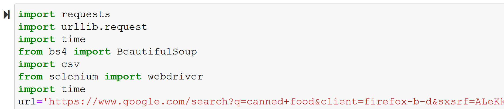
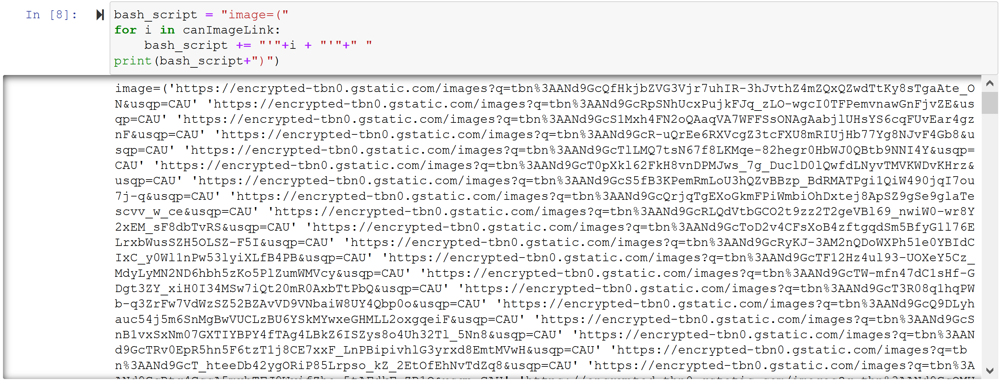
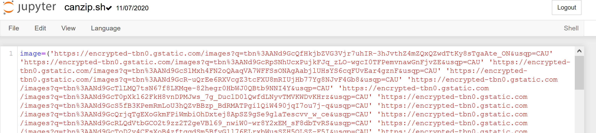

# ScrapeImageTool
Download Images from Search Engine - intended use for datasets to train ML models

I needed image datasets to train Machine Learning Models but ImageNet was down. So I created a tool to   
(1) get me links of images  
(2) download the images from the link onto my computer with names that allow folder to be zippable

I used   
(1) python on juypter notebook, beautiful soup and selenium to get links of images  
(2) bash script to download images from link onto computer

## user guide 
First, open the jupyter notebook in an IDE. Search for your desired trained item on the search engine and replace the variable url in the jupyter notebook with the url you found.   
  
The jupyter notebook takes the input of the search engine url and returns the concatenated form of the image links. It should look like:  
  
Next, open the bash script. Replace the first line of the bash script with the concatenated form of the image links.  It should look like:  
  
In your linux terminal, enable the execute permission on the bash file. If you use windows, make sure to enable linux subsystems on windows to use the following command.  
`chmod +x filename.sh`  
Then, run the bash scriptwith the following command. The images would appear in the same file that you run your bash script in.  
`./filename.sh`  
Remember to do a quick check through on the images you have downloaded to remove some of the irrelevant images before you use the images to train the models as some images may not be accurate to the search term!

## other notes
I chose to rename the images i downloaded when using wget to download images because some of the images that i downloaded had names with weird characters which prevented me from zipping the folder. Zipping the folder was preferrable as the folder was big with many images.  
If you enabled linux subsystems on windows and would like to get to your local C drive, you can do so with the following command.  
`cd /mnt/c`  
Another note to self is to check hackathon details before committing because i only realised that i wasn't able to join the hackathon after preparation done for the demo :(

## resources
https://www.crummy.com/software/BeautifulSoup/bs4/doc/
